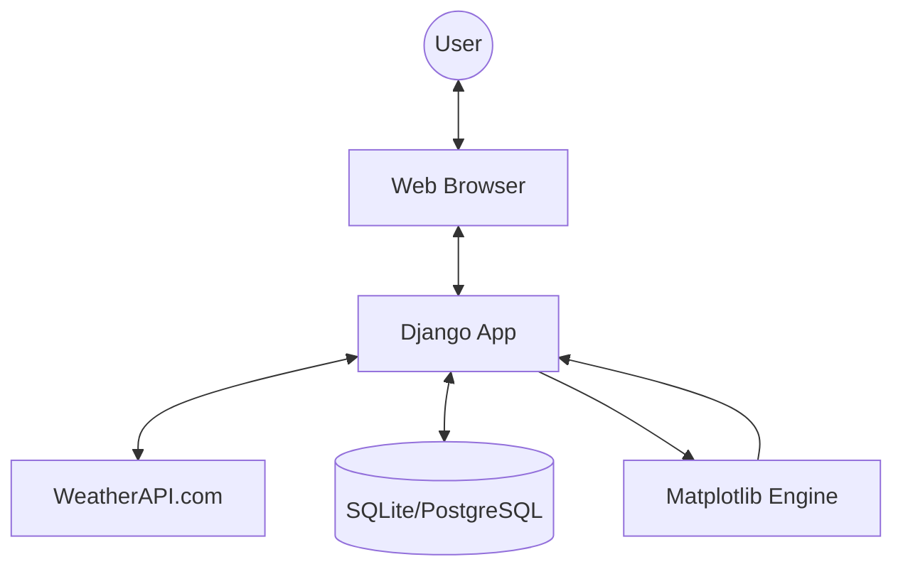

# 🌦️ Weather Manager

Weather Manager is a robust Django-based web application designed to fetch, display, and manage real-time weather data. It leverages the [WeatherAPI](https://www.weatherapi.com/) to provide users with comprehensive weather insights, including current conditions, 2-day forecasts, and 5-day historical data.

---

## 📑 Table of Contents
1. [Features](#-features)
2. [Architecture Overview](#-architecture-overview)
3. [Tech Stack](#-tech-stack)
4. [Getting Started](#-getting-started)
   - [Prerequisites](#prerequisites)
   - [Option 1: Local Setup (Virtualenv)](#option-1-local-setup-virtualenv)
   - [Option 2: Docker Setup](#option-2-docker-setup)
5. [Database Schema](#-database-schema)
6. [API Integration](#-api-integration)
7. [Screenshots & Visuals](#-screenshots--visuals)
8. [Project Structure](#-project-structure)
9. [Contributing](#-contributing)
10. [License](#-license)

---

## ✨ Features

### 👤 For All Users
- **Global Weather Search**: Get real-time weather data for any location worldwide.
- **Smart Location Suggestions**: Automatically detects and suggests locations based on your public IP address.
- **Current Conditions**: Detailed info including temperature, wind speed, pressure, humidity, and cloudiness.

### 🔐 For Registered Users
- **Extended Forecast**: 2-day weather forecast for searched locations.
- **Historical Insights**: 5-day historical weather data with interactive temperature charts.
- **Favorites Management**: Save favorite places for quick access and personalized suggestions.
- **Personalized Experience**: Custom dashboard showing weather for your preferred location.

---

## 🏗️ Architecture Overview

The application follows the classic **Model-View-Template (MVT)** architecture of Django.



### Key Components:
- **`account`**: Manages user authentication and custom profiles.
- **`weather`**: Core logic for fetching API data, caching results, and generating charts.
- **`weather_manager`**: Project configuration and routing.

---

## 🛠️ Tech Stack

- **Backend**: Python 3.x, Django 4.1
- **Database**: SQLite (Development), PostgreSQL (Production/Heroku)
- **Data Visualization**: Matplotlib, NumPy
- **API Communication**: Requests
- **Frontend**: HTML5, CSS3, JavaScript (Django Templates)
- **DevOps**: Docker, Docker-compose, Gunicorn, Whitenoise
- **Styling**: Django Widget Tweaks

---

## 🚀 Getting Started

### Prerequisites
- Python 3.10+
- Docker (optional)
- WeatherAPI Key (default provided in settings, but recommended to use your own)

### Option 1: Local Setup (Virtualenv)

1. **Clone the repository**
   ```bash
   git clone https://github.com/zacniewski/weather-manager.git
   cd weather-manager
   ```

2. **Create and activate virtual environment**
   - **Unix/macOS**:
     ```bash
     python -m venv venv
     source venv/bin/activate
     ```
   - **Windows**:
     ```bash
     python -m venv venv
     .\venv\Scripts\activate
     ```

3. **Install dependencies**
   ```bash
   pip install -r requirements.txt
   ```

4. **Database Setup**
   ```bash
   python manage.py makemigrations
   python manage.py migrate
   ```

5. **Create Superuser** (to access `/admin`)
   ```bash
   python manage.py createsuperuser
   ```

6. **Run Development Server**
   ```bash
   python manage.py runserver
   ```
   Access the app at `http://127.0.0.1:8000/`

### Option 2: Docker Setup

1. **Build and Run**
   ```bash
   docker-compose up --build
   ```

2. **Access the app**
   The application will be available at `http://localhost:8000`

---

## 📊 Database Schema

| Model | Fields | Description |
| :--- | :--- | :--- |
| **User** | `username`, `email`, `password`, `email_verified` | Custom user model extending AbstractUser. |
| **FavouriteLocation** | `owner`, `location`, `created` | Stores user's favorite locations. |
| **WeatherData** | `location`, `temperature`, `condition`, `wind_kph`, `humidity`, etc. | Cache for weather data (data older than 3h is hidden). |

---

## 🔌 API Integration

The app integrates with [WeatherAPI.com](https://www.weatherapi.com/).

**Example Request (Current Weather):**
```bash
GET https://api.weatherapi.com/v1/current.json?key=YOUR_API_KEY&q=London&aqi=no
```

**Example JSON Response:**
```json
{
  "location": { "name": "London", "region": "City of London", "country": "United Kingdom" },
  "current": {
    "temp_c": 12.0,
    "condition": { "text": "Clear", "icon": "//cdn.weatherapi.com/..." },
    "wind_kph": 19.1,
    "humidity": 82
  }
}
```

---

## 📂 Project Structure

```text
weather-manager/
├── account/            # User management & Authentication
├── weather/            # Main application logic (Views, Models, Charts)
├── weather_manager/    # Project settings & URL configuration
├── static/             # Static files (CSS, JS, Images, Plots)
├── templates/          # HTML Templates
├── Dockerfile          # Docker configuration
├── docker-compose.yml  # Multi-container orchestration
└── manage.py           # Django management script
```

---

## 🤝 Contributing

Contributions are welcome! Please feel free to submit a Pull Request.
1. Fork the Project
2. Create your Feature Branch (`git checkout -b feature/AmazingFeature`)
3. Commit your Changes (`git commit -m 'Add some AmazingFeature'`)
4. Push to the Branch (`git push origin feature/AmazingFeature`)
5. Open a Pull Request

---

## 📄 License

Distributed under the MIT License. See `LICENSE` for more information (if applicable).

---
Developed with ❤️ by Artur
